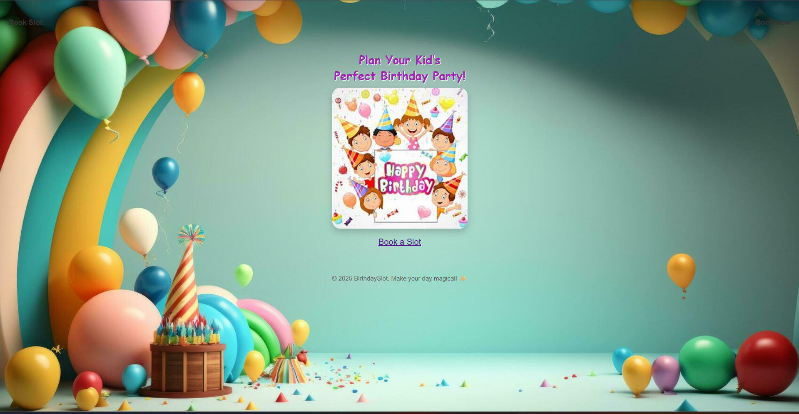
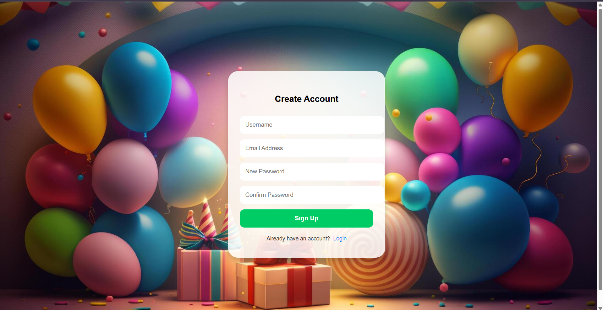
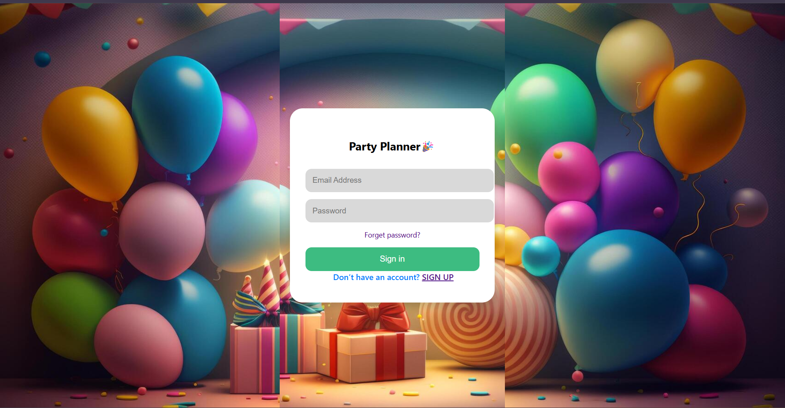
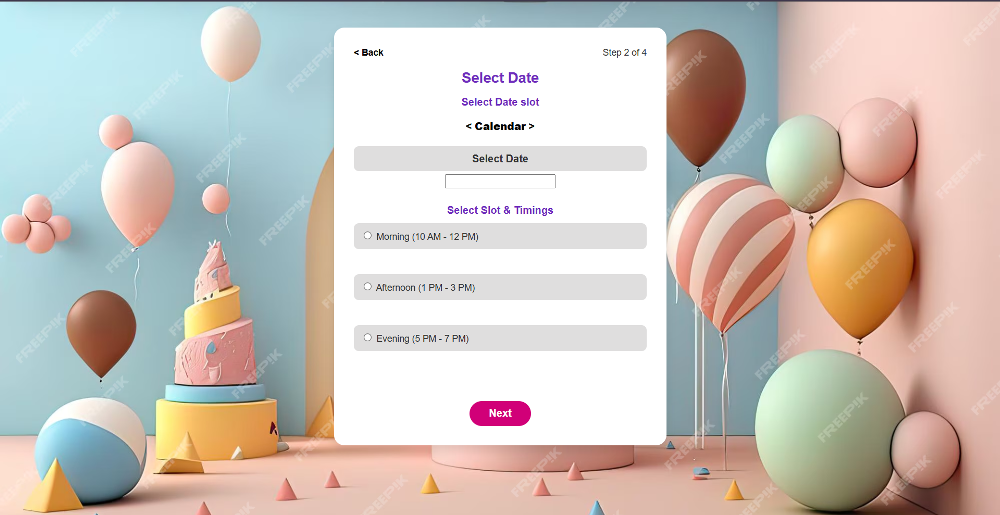
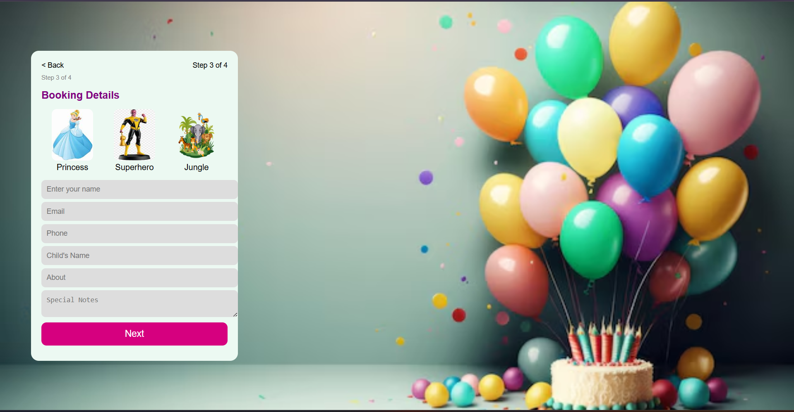
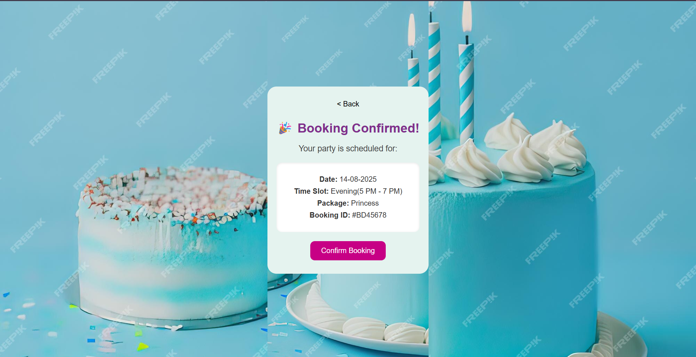

# 🎉 Birthday Party Slot Booking - Django Project

A user-friendly Django web application that allows users to book birthday party slots with ease. This project follows a clean UI designed in Figma and supports full user authentication and slot management.

🔗 **Figma Design**: [View on Figma](https://www.figma.com/design/BZioSdIh0c33eNuaUs4h7d/Birthday-Party-Slot-Booking?node-id=0-1&t=2wYJb1dl7vRJGNwm-0)

---

## 📸 Screenshots

### 1. Welcome Page


### 2. Signup Page


### 3. Login Page


### 4. Select Slot Page


### 5. Booking Details Page


### 6. Booking Confirmed Page


---

## 🧩 Features

- 🔐 User Signup and Login
- 📅 Date & Time Slot Selection
- ✅ Booking Confirmation Screen
- 🧾 Booking Summary View
- 🛠 Admin Panel to manage bookings

---

## 🛠 Tech Stack

- Django 4.x
- HTML, CSS, JavaScript
- SQLite (default) or PostgreSQL
- Figma (for UI design)

---

## 🚀 Setup Instructions

1. **Clone the repository**  
```bash
https://github.com/nandeswari26/birthday-booking-app.git
